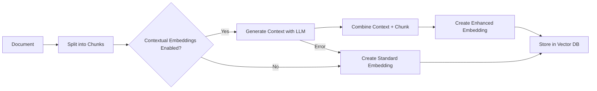

# Contextual Embeddings for Enhanced RAG

## Overview

Contextual embeddings are an advanced RAG (Retrieval-Augmented Generation) technique that significantly improves search accuracy by enriching text chunks with contextual information from their source documents. Instead of embedding isolated chunks, this feature uses an LLM to generate contextual summaries that situate each chunk within the broader document, making retrieval more precise and context-aware.

## Why Use Contextual Embeddings?

### The Problem with Standard Chunking

When documents are split into chunks for vector search, individual chunks often lose important context:

- **Lost Context**: A chunk discussing "the solution" doesn't indicate what problem it solves
- **Ambiguous References**: Pronouns and references become unclear without surrounding text
- **Missing Structure**: The chunk's position and role in the document hierarchy is lost
- **Reduced Searchability**: Queries may not match isolated chunks that would be relevant in context

### How Contextual Embeddings Solve This

Contextual embeddings address these issues by:

1. **Adding Document Context**: Each chunk is prefixed with a brief contextual summary
2. **Preserving Relationships**: The summary explains how the chunk relates to the overall document
3. **Improving Matching**: Enhanced chunks match more relevant queries
4. **Maintaining Coherence**: Retrieved chunks are more understandable in isolation

### Example Comparison

**Original Chunk:**

```
The implementation uses a recursive approach with memoization
to optimize performance. This reduces time complexity from O(2^n)
to O(n).
```

**With Contextual Embedding:**

```
This chunk from a technical article about Fibonacci sequence algorithms 
discusses the optimized recursive implementation with memoization, 
explaining its performance benefits.
---
The implementation uses a recursive approach with memoization
to optimize performance. This reduces time complexity from O(2^n)
to O(n).
```

## How It Works

### Technical Architecture

1. **Document Chunking**: Documents are split into manageable chunks as usual
2. **Context Generation**: For each chunk, an LLM generates a contextual summary
3. **Parallel Processing**: Multiple chunks are processed concurrently using ThreadPoolExecutor
4. **Embedding Creation**: The enhanced chunk (context + original) is embedded
5. **Storage**: Both the embedding and metadata are stored in the vector database
6. **Fallback Mechanism**: If context generation fails, standard embeddings are used

### Processing Flow



## Configuration

### Enabling the Feature

Set the following environment variable to enable contextual embeddings:

```bash
USE_CONTEXTUAL_EMBEDDINGS=true
```

### Configuration Options

| Variable | Default | Description | Valid Range |
|----------|---------|-------------|-------------|
| `USE_CONTEXTUAL_EMBEDDINGS` | `false` | Enable/disable contextual embeddings | `true`/`false` |
| `CONTEXTUAL_EMBEDDING_MODEL` | `gpt-4o-mini` | OpenAI model for context generation | Any valid OpenAI model |
| `CONTEXTUAL_EMBEDDING_MAX_TOKENS` | `200` | Maximum tokens for context generation | 1-4096 |
| `CONTEXTUAL_EMBEDDING_TEMPERATURE` | `0.3` | Temperature for context generation | 0.0-2.0 |
| `CONTEXTUAL_EMBEDDING_MAX_DOC_CHARS` | `25000` | Maximum document size for context | Positive integer |
| `CONTEXTUAL_EMBEDDING_MAX_WORKERS` | `10` | Parallel processing threads | 1-20 |

### Example Configurations

#### High-Quality Context (Slower, More Expensive)

```bash
USE_CONTEXTUAL_EMBEDDINGS=true
CONTEXTUAL_EMBEDDING_MODEL=gpt-4
CONTEXTUAL_EMBEDDING_MAX_TOKENS=300
CONTEXTUAL_EMBEDDING_TEMPERATURE=0.5
```

#### Balanced Performance (Recommended)

```bash
USE_CONTEXTUAL_EMBEDDINGS=true
CONTEXTUAL_EMBEDDING_MODEL=gpt-4o-mini
CONTEXTUAL_EMBEDDING_MAX_TOKENS=200
CONTEXTUAL_EMBEDDING_TEMPERATURE=0.3
```

#### Fast Processing (Lower Quality)

```bash
USE_CONTEXTUAL_EMBEDDINGS=true
CONTEXTUAL_EMBEDDING_MODEL=gpt-3.5-turbo
CONTEXTUAL_EMBEDDING_MAX_TOKENS=100
CONTEXTUAL_EMBEDDING_TEMPERATURE=0.2
```

## Performance Considerations

### Processing Time

- **Overhead**: Contextual embeddings add 1.5-2x processing time
- **Parallelization**: Using multiple workers significantly reduces wall-clock time
- **Caching**: Repeated chunks could benefit from caching (future enhancement)

### Cost Implications

Contextual embeddings incur additional OpenAI API costs:

| Model | Cost per 1K chunks | Context Tokens |
|-------|-------------------|----------------|
| gpt-4o-mini | ~$0.06 | 200 tokens/chunk |
| gpt-3.5-turbo | ~$0.10 | 200 tokens/chunk |
| gpt-4 | ~$0.60 | 200 tokens/chunk |

*Costs are estimates based on typical usage patterns*

### Memory Usage

- **Peak Memory**: Increases with `CONTEXTUAL_EMBEDDING_MAX_WORKERS`
- **Document Storage**: Full documents are held in memory during processing
- **Recommended**: 4GB RAM minimum for large document batches

## Best Practices

### When to Use Contextual Embeddings

✅ **Recommended for:**

- Technical documentation with cross-references
- Long-form articles and reports
- Code documentation with examples
- Academic papers and research documents
- Content with ambiguous terminology

❌ **Not recommended for:**

- Short, self-contained documents
- Structured data (JSON, CSV)
- Real-time processing requirements
- Budget-constrained projects

### Optimization Tips

1. **Batch Processing**: Process multiple documents together for efficiency
2. **Model Selection**: Use gpt-4o-mini for best cost/performance ratio
3. **Worker Tuning**: Set workers to CPU cores - 1 for optimal performance
4. **Document Size**: Keep documents under 25K chars to avoid truncation
5. **Error Monitoring**: Monitor logs for API failures and fallback rates

## Troubleshooting

### Common Issues and Solutions

#### High Failure Rate

**Symptom**: Many chunks falling back to standard embeddings
**Solution**:

- Check OpenAI API key and rate limits
- Reduce `CONTEXTUAL_EMBEDDING_MAX_WORKERS`
- Implement exponential backoff (coming soon)

#### Slow Processing

**Symptom**: Document processing takes too long
**Solution**:

- Increase `CONTEXTUAL_EMBEDDING_MAX_WORKERS`
- Use a faster model (gpt-3.5-turbo)
- Reduce `CONTEXTUAL_EMBEDDING_MAX_TOKENS`

#### Poor Context Quality

**Symptom**: Generated context isn't helpful
**Solution**:

- Increase `CONTEXTUAL_EMBEDDING_MAX_TOKENS`
- Use a more capable model (gpt-4)
- Adjust `CONTEXTUAL_EMBEDDING_TEMPERATURE`

#### Memory Issues

**Symptom**: Out of memory errors
**Solution**:

- Reduce `CONTEXTUAL_EMBEDDING_MAX_WORKERS`
- Process smaller document batches
- Reduce `CONTEXTUAL_EMBEDDING_MAX_DOC_CHARS`

### Monitoring and Debugging

Enable debug logging to monitor contextual embedding performance:

```python
import logging
logging.getLogger('utils.embeddings').setLevel(logging.DEBUG)
```

Key metrics to monitor:

- Success/failure ratio for context generation
- Average context generation time
- API token usage
- Memory consumption peaks

## Advanced Usage

### Custom Context Prompts

While not currently configurable, future versions will support custom prompts for specific document types:

```python
# Future enhancement example
CONTEXTUAL_EMBEDDING_PROMPT_TEMPLATE = """
For this technical documentation chunk, provide:
1. The main topic or API being discussed
2. Its relationship to the broader system
3. Key technical terms defined
"""
```

### Selective Application

Apply contextual embeddings only to specific document types:

```python
# In your crawling code
if document_type in ['technical', 'academic']:
    os.environ['USE_CONTEXTUAL_EMBEDDINGS'] = 'true'
else:
    os.environ['USE_CONTEXTUAL_EMBEDDINGS'] = 'false'
```

### Performance Benchmarking

Run the included benchmark tests to evaluate performance:

```bash
uv run pytest tests/test_contextual_embeddings_integration.py::test_performance_comparison -v
```

## Future Enhancements

Planned improvements for contextual embeddings:

1. **Caching Layer**: Cache context for repeated chunks
2. **Custom Prompts**: Configure prompts per document type
3. **Adaptive Processing**: Automatically adjust based on document complexity
4. **Local Models**: Support for local LLMs to reduce costs
5. **Incremental Updates**: Update context without full reprocessing
6. **Language Detection**: Multi-language context generation

## FAQ

**Q: Will contextual embeddings work with my existing data?**
A: Yes, it's backward compatible. Existing embeddings remain unchanged.

**Q: Can I mix contextual and standard embeddings?**
A: Yes, the system tracks which chunks use contextual embeddings via metadata.

**Q: What happens if the OpenAI API is down?**
A: The system automatically falls back to standard embeddings with logging.

**Q: How much does this increase storage requirements?**
A: Embedding dimensions remain the same (1536). Only metadata increases slightly.

**Q: Can I use this with other embedding models?**
A: Currently OpenAI-only for context generation, but any model for embeddings.

## Support

For issues or questions about contextual embeddings:

1. Check the troubleshooting section above
2. Review logs for specific error messages
3. Open an issue on GitHub with reproduction steps
4. Include your configuration and document samples

## References

- [Anthropic's Contextual Retrieval](https://www.anthropic.com/news/contextual-retrieval)
- [RAG Best Practices](https://docs.llamaindex.ai/en/stable/optimizing/production_rag/)
- [OpenAI Embeddings Guide](https://platform.openai.com/docs/guides/embeddings)
